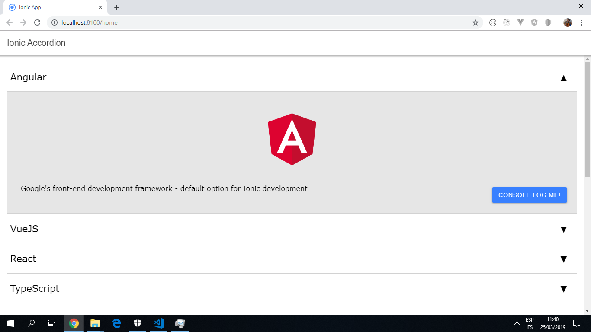

# :zap: Ionic Angular Accordian

App to create a simple accordian widget using the [Ionic 5 framework](https://ionicframework.com/docs).
Accordions are often used in the UI for grouping and display of related information.

## :page_facing_up: Table of contents

* [General info](#general-info)
* [Screenshots](#screenshots)
* [Technologies](#technologies)
* [Setup](#setup)
* [Features](#features)
* [Status](#status)
* [Inspiration](#inspiration)
* [Contact](#contact)

## :books: General info

* Uses a [CUSTOM_ELEMENTS_SCHEMA](https://angular.io/api/core/CUSTOM_ELEMENTS_SCHEMA).

## :camera: Screenshots



## :signal_strength: Technologies

* [Ionic v5](https://ionicframework.com/)

* [Ionic/angular v5](https://www.npmjs.com/package/@ionic/angular)

* [Angular v9](https://angular.io/)

## :floppy_disk: Setup

* To start the server on _localhost://8100_ type: 'ionic serve' or on _localhost://4200_ type: 'ng serve'

## :computer: Code Examples

* functions to display info on ech technology from the simple array created in the ts file.

```html
  <app-accordion
     *ngFor="let technology of technologies"
     name="{{ technology.name }}"
     description="{{ technology.description }}"
     image="{{ technology.image }}"
     (change)="captureName($event)"></app-accordion>
```

## :cool: Features

* Data is stored in an array of objects but this could be replaced with json data from an API call.

* Updated to latest Ionic/Angular versions with dependency updates and all dependency vulnerabilities resolved.

## :clipboard: Status & To-do list

* Status: Working widget, accordion opens and data is accessed from the array and displayed.

* To-do: work out how to add html links inside the accordion, maybe by using a function.

## :clap: Inspiration

Project inspired by [Mastering Ionic's 'Creating a simple accordion widget in Ionic 4'](http://masteringionic.com/blog/2019-01-27-creating-a-simple-accordion-widget-in-ionic-4/).

## :envelope: Contact

* Repo created by [ABateman](https://www.andrewbateman.org) - you are welcome to [send me a message](https://andrewbateman.org/contact)
